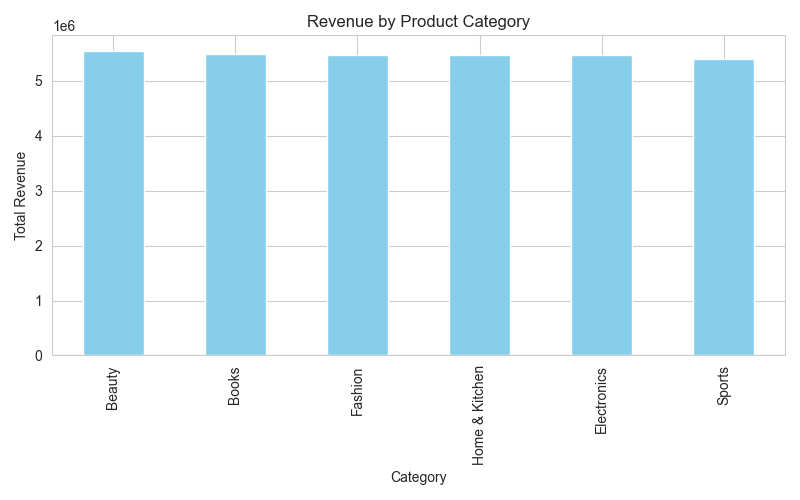
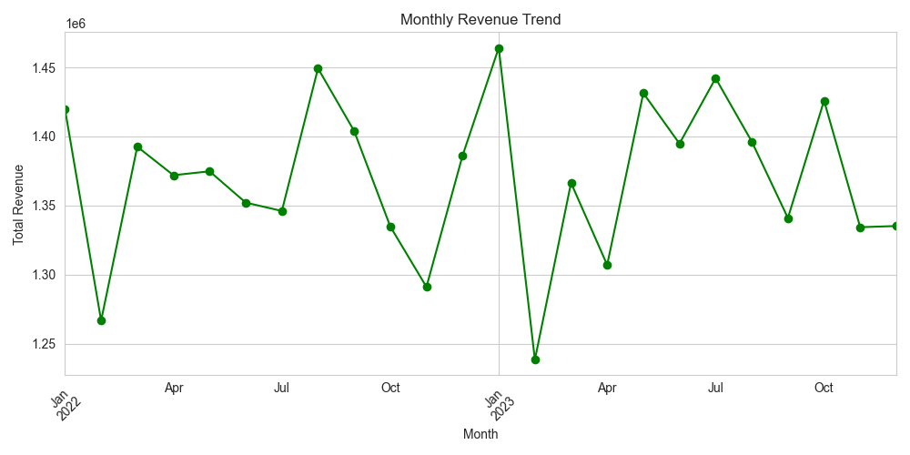

##Amazon E-Commerce Sales Data Analysis:-

##Project Overview:
      I analyzed Amazon e-commerce sales data to understand what drives revenue and which products, categories, and regions perform the best. By looking at order        history, discounts, and customer behavior, I identified trends that can help sellers make smarter decisions.
      I cleaned and prepared the dataset, performed analysis on top products, categories, and customer regions, and visualized the findings with charts. This            project demonstrates my practical skills in Python, data analysis, and visualization.
      
##Tools & Libraries:
      - Python
      - Pandas
      - NumPy
      - Matplotlib
      - Seaborn
      
##Key Insights:
      I found that a handful of products generate most of the revenue, showing which items are Amazon favorites.  
      Sales spike during festive months — gift shopping drives revenue!  
      Middle East and North America are the top-performing regions, showing where customers spend the most.  
      Beauty, Books, and Fashion categories are the most profitable, suggesting where sellers should focus their promotions.
      
##Bonus Analysis:
      I calculated average ratings per category to see how customer satisfaction varies.  
      I analyzed total quantity sold per category to understand product popularity beyond revenue.
      
##Visualizations:
      **Revenue by Product Category**
      Shows which product categories contribute the most to Amazon’s revenue.  
        
      **Monthly Revenue Trend**
      Shows how revenue changes month to month, highlighting peak sales periods.  
      
      
##How to Run:
      1. Download or clone this repository.  
      2. Install required Python libraries: pandas, numpy, matplotlib, seaborn.  
      3. Run `ecommerce_analysis.py` to see the full analysis and chart.
      
##Business Takeaway:
      This analysis can help sellers decide **which products to promote**, **which regions to target**, and **when to run marketing campaigns** for maximum              revenue.

